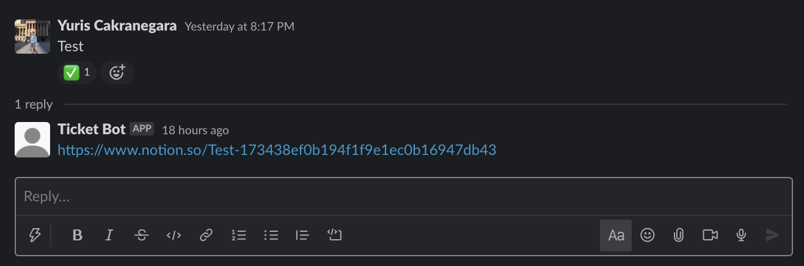
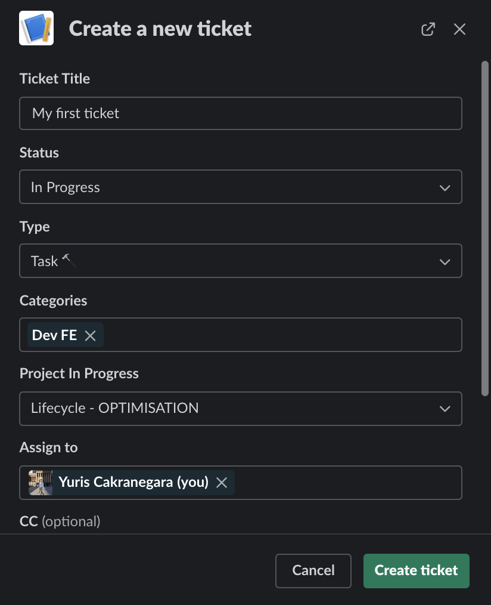
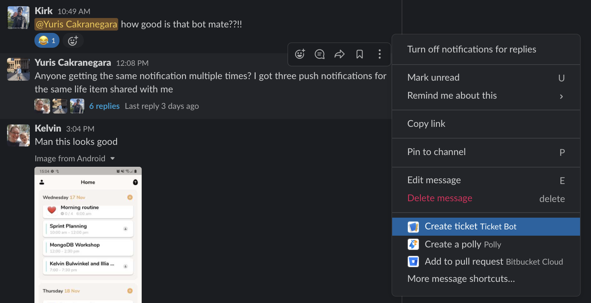
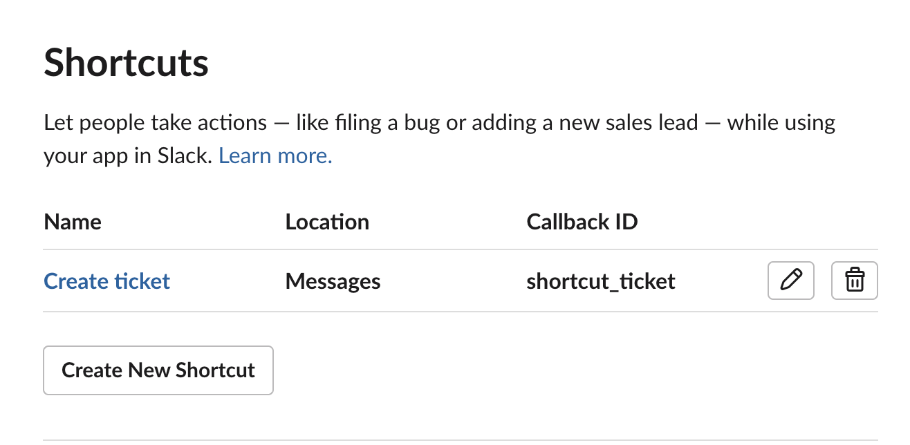
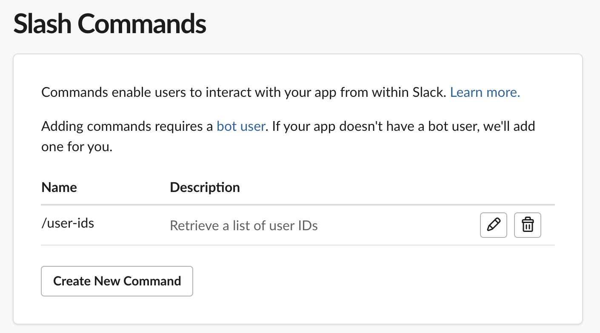
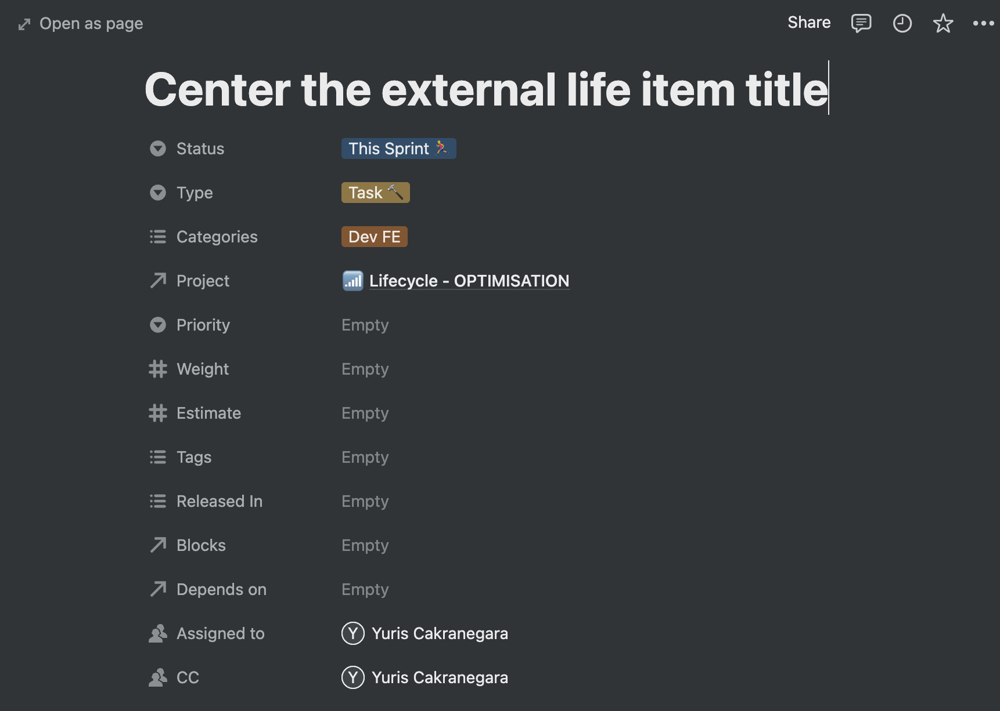
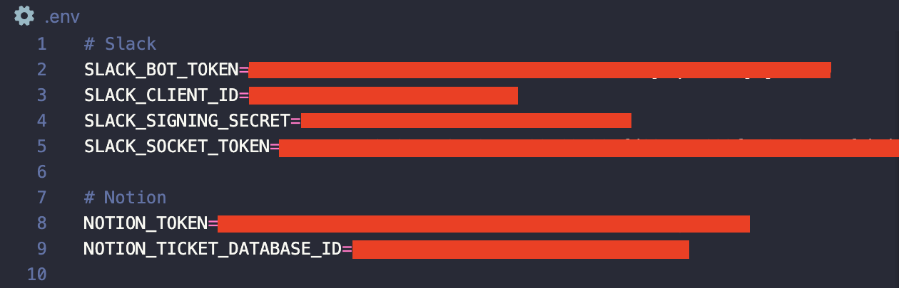
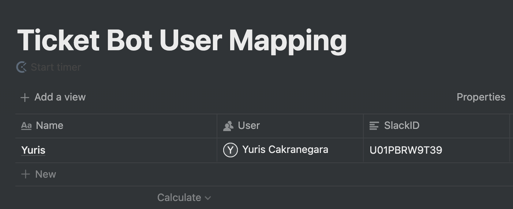
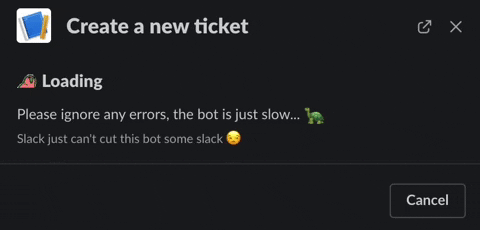

# Slack to Notion Ticket Bot
A Slack bot to help create a Notion page from a Slack message. This bot sends back a reply to the Slack message with a link to the Notion page it just created and adds a :white_check_mark: reaction as a marker.

You can customise the bot to add specific properties for the pages. By default, the bot will show you a form to customise the page it's going to create.

This bot is made to be deployed to [AWS Lambda](https://aws.amazon.com/lambda/) using [Serverless](https://serverless.com/) framework.

## Why are we building this?
In our workplace, we use Slack as our discussion platform and Notion as our [kanban board](https://www.atlassian.com/agile/kanban/boards) and for any discussion notes. We have a channel on Slack specific for reporting issues and sharing feedbacks for our application, which a lot of the times we want to put them as tickets on Notion. 

We like to put a :white_check_mark: reaction to the discussion to let the team know that we have created a ticket for it, then link the URL to the ticket as a reply to the discussion. To give the ticket more context, we also put a backlink to the Slack discussion as its description. 

As we implement more features and we have more to give feedbacks on, creating these tickets become tedious, hence why we created this bot to automate the task.

## Usage
This bot provides an interactive command to create a ticket from a Slack message. Simply select the "more" button on a message and choose "Create a ticket". The bot will then show you a form to customise your ticket as shown in the previous image.

## Getting Started
### Slack
1. [Set up a Slack app](https://slack.com/intl/en-au/help/articles/115005265703-Create-a-bot-for-your-workspace) if you haven't already
2. On your Slack app configuration, create a shortcut under the *Interactivity and Shortcuts* and set `shortcut_ticket` as its Callback ID
   
3. Under *Slash Commands*, create a new `/user-ids` command
   

### Notion
1. Create a [Notion integration](https://developers.notion.com/docs) to your workspace and take note of the integration token
2. Create a database in your Notion if you haven't. In this database, add the properties of the database entry like so:
    
    Note: Do not mistake the screenshot above as the database. That's just an example of the database entry
3. You don't have to exactly match what we have there, the important properties for setting up are:
   1. Status (Select)
   2. Type (Select)
   3. Categories (Multi-select)
   
   Make sure to have at least one selection for each property
4. Share your database to your Notion integration by pressing the share button on the top right of your database
5. [Copy your database ID](https://stackoverflow.com/questions/67728038/where-to-find-database-id-for-my-database-in-notion)

## Local testing
### Setting up
At the root of the project, create a `.env` file and put all the required tokens and your database ID like so:
   

### Configuration
There are a few files you will need to edit in the project to customise the bot to your own need:
1. Edit [this file](./src/modals/create_ticket_modal.ts) to customise your Slackbot form interface
2. Edit [this file](./lib/notion/ticket/create_ticket.ts) and [this file](./lib/notion/ticket/ticket_properties.ts) to customise the ticket creation logic
3. Edit [this file](./lib/notion/db/db.ts) if your tickets have properties needing an external Notion database (e.g. "Assigned to" and "Project" properties)

### Adding an external Notion database to the bot
You will need this method if you want the bot to be able to assign users into the ticket
1. Set up a separate database to map the Notion users to the Slack users
2. Create the database like so:
   
   Note that the property names have to be the exact match (Name, User, SlackID)
3. Fill in all your Notion users into the database
4. To get the Slack User IDs, you can run `/user-ids` on your Slack channel once the bot is running
5. Copy the **Ticket Bot User Mapping** database ID and put it into the `.env` and name it `NOTION_USER_DATABASE_ID`
    

### Running the bot locally
1. Open up a terminal at the root of this project, and run `npm run start:local`
2. Hook up another terminal and run `ngrok http 3000`
3. Ngrok will give you the URL for the bot, copy it
4. Follow [this guide](https://slack.dev/bolt-js/deployments/aws-lambda#run-the-app-locally) to tell your Slack bot to use your Ngrok URL

### Deploying to AWS Lambda
1. Change the AWS region to suit you in [serverless.yml](serverless.yml)
2. Follow [this guide](https://slack.dev/bolt-js/deployments/aws-lambda#set-up-aws-lambda) if you're new to AWS Lambda and Serverless framework
3. If you already have your AWS CLI set up, run `npm run deploy`
4. Follow [this guide](https://slack.dev/bolt-js/deployments/aws-lambda#run-the-app-locally) to tell your Slack bot to use your Lambda URL

## Known Issues
1. The bot is a little bit slow, an error message may come up when loading the form. This does not affect the ticket creation and you can ignore the errors from Slack
   
2. The ticket form may not close on submission. Submitting the form for the second time or just simply closing the form should be fine. No ticket duplications will be made.